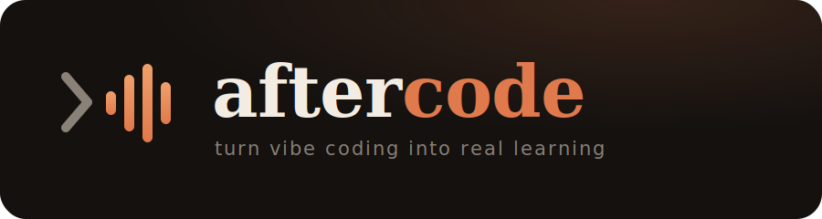

<p align="center">
  
</p>

# Aftercode

**Turn your daily AI coding sessions into personalized learning podcasts.**

Aftercode connects to your coding-agent workflow (Claude Code, Codex, Cursor, …), figures out the deeper technical topics behind what you built and debugged that day, and generates a short two-speaker podcast episode — in Hebrew or English — that teaches you the concepts behind the code you shipped. Listen and browse them in a clean web playlist.

> Turn vibe coding into real learning.

Open source (MIT OR Apache-2.0), CLI-first, self-hostable.

## Demo

https://github.com/ron3899/aftercode/releases/download/v0.1.0/demo.mp4

<video src="https://github.com/ron3899/aftercode/releases/download/v0.1.0/demo.mp4" controls width="720"></video>

▶ If it doesn't play above, [watch the demo](https://github.com/ron3899/aftercode/releases/download/v0.1.0/demo.mp4).

## How it works

```
aftercode episode
   │  auto-detect your coding-agent session (Claude Code / Codex / Cursor) →
   │    your prompts + what the agent did/explained
   │  + the real git diff (the Redis client, RabbitMQ config, new deps it added)
   │  scan for secrets, apply ignore rules, redact, cap size
   ▼
backend pipeline
   normalize → extract topics → detect knowledge gaps → rank →
   write two-speaker script (Hebrew or English) → TTS per segment
   (ElevenLabs or OpenAI) → concat + silence gaps → MP3 → store → episode
   ▼
web UI
   playlist · filter by topic · play through your episodes · transcript + quiz
```

## Repository layout

```
crates/aftercode-core    shared types (session context, episode, audio)
crates/aftercode-server  Axum API backend + generation pipeline + serves the web UI
crates/aftercode-cli     the `aftercode` CLI
web/                     React + Vite web UI (playlist, filters, player)
migrations/              SQLite schema (auto-applied on startup)
docs/                    PRD, self-hosting, architecture, design specs
```

## Install

**You need:** [Docker](https://docs.docker.com/get-docker/) (runs the backend + web UI) and
[Rust](https://rustup.rs) (for the `aftercode` CLI — it must run natively to read your local
coding-agent session files). That's it — no database, no Node.

Copy-paste these four commands:

```bash
# 1. Get the code
git clone https://github.com/ron3899/aftercode && cd aftercode

# 2. Start the backend + web UI  →  http://localhost:8080
#    (first run builds the image once, ~5 min; after that it's instant)
docker compose up -d

# 3. Install the CLI
cargo install --path crates/aftercode-cli

# 4. Log in (opens your browser → click Approve)
aftercode login
```

Now open **http://localhost:8080** to browse episodes, and run `aftercode episode` in any
project. Step 2 works with **no API keys** (mock mode) so you can try it immediately.

**For real episodes**, create a `.env` in the repo with your keys, then `docker compose up -d`
again:

```
LLM_PROVIDER=openai
OPENAI_API_KEY=sk-...
TTS_PROVIDER=openai        # voice via OpenAI tts-1; or set TTS_PROVIDER=elevenlabs + its keys
```

> Port 8080 taken? Run `PORT=9000 docker compose up -d` and use that port everywhere.

## Use it inside your coding agent

The CLI auto-detects your **current session** from whatever agent you used, so the simplest
workflow is: finish a chunk of work, then make the episode.

- **In the terminal** (any agent): `aftercode episode --language en` (or `he`). It reads the
  latest **Cursor**, **Claude Code**, or **Codex** session for that repo automatically.
- **Ask the agent to do it for you.** Since the agent has a terminal, just tell it:
  > "Run `aftercode episode --language en` to turn what we just did into a podcast."
- **Claude Code / Codex (CLI agents):** run it right after your session in the same folder —
  detection finds the transcript. If you ran from a different folder, hand the transcript in
  directly: `aftercode episode --transcript -` (pipe a transcript) — never fails detection.
- **Cursor / Windsurf (editor agents):** open the editor's terminal in your project and run
  `aftercode episode`; it reads Cursor's live session for that workspace.

Run `aftercode preview` first to see which agent + session was detected and exactly what will
be sent.

<details>
<summary>Run everything from source (no Docker)</summary>

Requires Rust + Node.

```bash
cd web && npm install && npm run build && cd ..   # build the UI (served at /)
cp .env.example .env                              # add keys, or leave mock to try
cargo run -p aftercode-server                     # first run prints a login token + URL
cargo install --path crates/aftercode-cli
aftercode login && cd your-project && aftercode episode --language en
```
</details>

## Web UI

The backend serves a React app at `/` (built from `web/dist`):

- **Playlist** — your episodes with a persistent bottom player that plays through the
  current filtered list (prev/next = your queue).
- **Filter by topic** (chips) + language + search — instant.
- **Episode detail** — player, topics, key takeaways, quiz, full host/expert transcript.
- Responsive (mobile + desktop). **Sign in** reuses the CLI approve flow — no token paste.

Dev with hot reload: `cd web && npm run dev` (Vite on `:5173`, talks to the backend; set
`VITE_API_BASE` in `web/.env`). Rebuild for production with `npm run build`.

## Auth

`aftercode login` (no arg) opens `<backend>/cli/authorize`; click **Approve** and the token
is captured automatically — for the CLI via a localhost loopback, for the web UI via a
browser redirect (no copy-paste). `aftercode login <token>` and `seed-user` remain for
scripts/CI; `aftercode status` validates the token against the backend.

> Local-approval performs **no identity check** — it's for trusted localhost/self-host only.
> A public/multi-user deployment needs a real OAuth provider (not yet built). This build is
> effectively single-user: any signed-in user sees all episodes.

## Reliable session capture

Episodes are built from your agent **session** + the git **diff**. Aftercode auto-detects the
session from Claude Code / Codex / Cursor on-disk storage (Cursor reads its live SQLite WAL),
but detection can miss (e.g. a run from a subfolder). Two safeguards:

- **Hand the transcript in directly:** `your-transcript | aftercode episode --transcript -`
  (accepts a Claude Code `.jsonl`, simple `{"role","text"}` JSONL, or plain text) — skips
  disk auto-detection.
- **Thin-episode guardrail:** if no session conversation is captured, `episode` refuses (so
  you never get an episode about a lone `package-lock.json`). Override with `--allow-thin`.
  Run `aftercode preview` first to see what was collected and which agent was detected.

## Configuration

All secrets/config via env (see `.env.example` and `docs/SELF_HOSTING.md`):

- `DATABASE_URL` — SQLite, default `sqlite://aftercode.db?mode=rwc` (auto-created + migrated)
- `LLM_PROVIDER` — `anthropic` (default, `claude-opus-4-8`) / `openai` / `mock`; `ANTHROPIC_API_KEY` / `OPENAI_API_KEY`
- `TTS_PROVIDER` — `elevenlabs` (default) / `openai` / `mock`
  - ElevenLabs: `ELEVENLABS_API_KEY`, `ELEVENLABS_HOST_VOICE_ID`, `ELEVENLABS_EXPERT_VOICE_ID`
  - OpenAI: `OPENAI_TTS_MODEL` (default `gpt-4o-mini-tts`), `OPENAI_TTS_VOICE_HOST`, `OPENAI_TTS_VOICE_EXPERT`
- `BLOB_STORE` — `localfs` (default) / `s3` (+ `S3_BUCKET`); audio served at `/static/episodes/<id>.mp3`
- `APP_PUBLIC_URL`, `BIND_ADDR`, `WEB_DIST` (path to the built web app)

LLM providers are pluggable behind a trait; topic + script stages use structured JSON output.
The script is written in the episode's language (Hebrew keeps tech terms in English, the way
Israeli devs speak).

## Privacy

Aftercode sends your agent-session transcript (prompts + agent messages + the commands/edits
it ran) and the **git diff hunks** — never full source files, `.env`, secrets, or ignored
paths. A regex secret scanner redacts anything that looks like a key/token before upload,
payload size is capped, and `aftercode preview` shows exactly what would be sent.

## Status

- **Phase 1 (done):** Rust CLI + API backend — session capture, topic/script generation,
  TTS, audio assembly, episode storage. Browser login.
- **Phase 2 (done):** React + Vite web UI — playlist, topic filter, player, episode detail.
- **Phase 3 (planned):** real OAuth/multi-user, auto-daily generation, download/share,
  private RSS, editor extensions. See `docs/superpowers/specs`.

## License

Licensed under either of MIT (`LICENSE-MIT`) or Apache-2.0 (`LICENSE-APACHE`) at your option.
